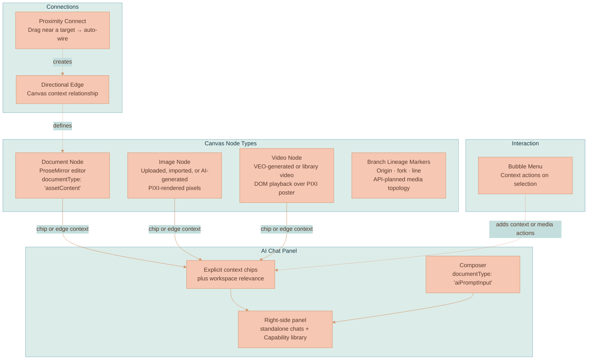
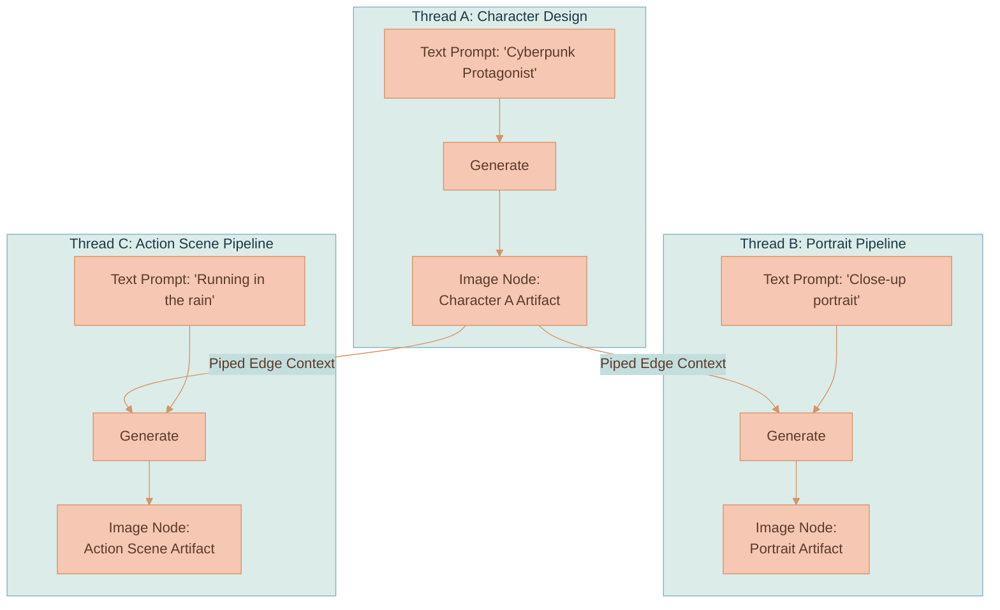
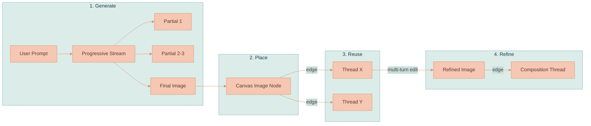
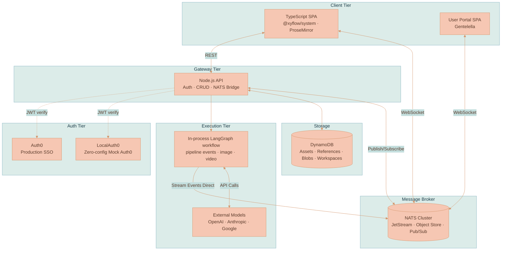
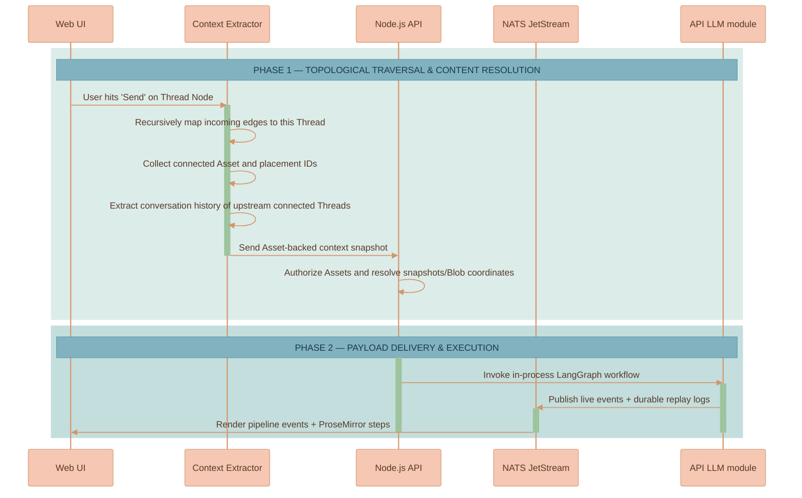
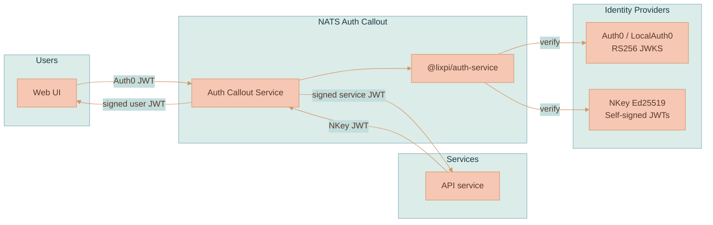

# Lixpi - Product Overview

Lixpi is a visual, node-based workflow engine engineered for building advanced AI image and video generation pipelines. Functionally, it sits at the intersection of an infinite spatial canvas (similar to Miro) and a visual logic execution pipeline (similar to n8n). Conceived and architected well before n8n's public release, Lixpi introduces a fundamental paradigm shift for generative AI tools: **spatial arrangement IS the workflow**.

Instead of writing complex workflow DSLs or using linear chat prompts, users map out ideas topologically. The spatial relationships between documents and media nodes, plus explicit chat-panel context chips, dictate the context extraction, dependency chains, and execution sequence of the underlying AI models.

---

## 1. Core Concept & Capabilities

Lixpi solves the problem of "context collapse" and isolated text-generation loops found in traditional AI interfaces.

It is tailored specifically for complex multi-model setups, excelling at **AI image and video generation workflows**. The standout feature is its mechanical ability to enable complex scene creation and maintain strict character consistency without relying solely on fragile prompt engineering.

By treating all generated text, images, and video iterations as concrete "nodes" that exist statically on the canvas, engineers and creators can physically pipe these individual artifacts into subsequent generation threads. This visual piping ensures that any AI model downstream receives the exact generated output of an upstream model as direct, unambiguous context.

---

## 2. Canvas Primitives

The workspace canvas is an infinite, zoomable surface rendered in vanilla TypeScript using `@xyflow/system` for pan/zoom coordinate math. Text-bearing document nodes embed ProseMirror editors; media nodes use specialized canvas chrome. The renderer draws document, image, video, branch origin, branch fork, and branch line nodes. Standalone conversation Assets render in the right-side AI Chat panel instead of as canvas nodes.

| Node Type | Editor | Resize | Persistence |
|-----------|--------|--------|-------------|
| **Document** | ProseMirror Asset `content` role | Free | Asset snapshot Blob + workspace node geometry |
| **Image** | None (PIXI pixels + DOM chrome) | Aspect-ratio locked | Asset media renditions + workspace node geometry |
| **Video** | None (PIXI poster + DOM `<video>` chrome) | Aspect-ratio locked | Asset media renditions + workspace node geometry |
| **Audio** | DOM `<audio>` playback surface | Fixed strip | Asset original rendition + workspace node geometry |
| **Uploaded Document Media** | None (PDF/text/document preview) | Aspect-ratio locked | Asset document-media renditions + workspace node geometry |
| **Branch Origin / Fork / Line** | None | API-positioned topology markers | Workspace `canvasState`; conversation/output relationships use Asset IDs |
| **Conversation** | ProseMirror Asset `conversation` role in the panel | Panel-owned | Asset snapshot Blob + workspace panel/surface reference |

**Edges** are directional connections stored in `canvasState.edges`. Each edge records a context relationship between canvas nodes. Edges can be created by explicit handle drag or by **Proximity Connect**, which previews and commits a connection when a node is dragged within range of a target.

**AI Chat Panel Composer** is a separate ProseMirror editor (`documentType: 'aiPromptInput'`) inside the right-side panel. It provides rich-text composition, model controls, image/video generation settings, and Cmd/Ctrl+Enter to submit. The composer is decoupled from durable sessions; the panel creates a standalone chat only on first submit.

**Media Library** is the Asset catalog in the canvas-owned right-side panel. Reusing media attaches the same Asset under a fresh node ID; it never copies bytes. Scope/catalog/workspace references determine visibility and lifetime.

**Capabilities, Tools, and Skills** are reusable AI behavior in the adjacent library surface. A Capability is a source-registered top-level module with one entry package and explicitly contained Tool/Skill packages. A Skill contributes sealed instructions and resources; a Tool runs an allowlisted declarative workflow. `/` selects top-level Capability modules. The media-first `@` picker references authorized media by default and can switch to Capability modules or standalone Tools and Skills. Module-internal packages never appear as standalone rows. Prompt references persist as typed atoms in the conversation document and are reauthorized by the API; choosing a library Asset does not add it to the canvas. Tool progress is durable and renders through the same projection in chat and in the side panel. Style Extraction is a built-in Capability that saves reusable visual behavior as a standalone Tool without introducing a separate storage model.

**AI Chat Panel and Sessions** are workspace-owned UI and conversation state, not a canvas-node requirement. The right-side AI Chat launcher opens an empty panel without creating a chat record. A standalone chat is created only after the user submits its first prompt. Panel visibility, open tabs, active tab, panel width, prompt drafts, explicit context chips, and whether the Sessions list is expanded are persisted in the workspace. Sessions is collapsed by default; when expanded it can reopen closed sessions until they are explicitly deleted.

---

## 3. Artifact Piping & Character Consistency

In typical AI generators, maintaining the exact same character across multiple different poses or scenes using text prompts alone is notoriously difficult. Lixpi solves this through **Artifact Piping**.

When an AI thread generates an image, that image becomes an independent artifact node on the canvas. You can then draw directional edges from this single image node into multiple separate AI threads to use as source material.

By piping the exact same reference artifact into different threads, consistency is guaranteed mechanically. This architecture extends to video generation: images can seed image-to-video, prior videos contribute a representative still for branch grounding, and explicit **Extend video in new thread** actions pass the MP4 to VEO's video-extension input.

---

## 4. Image Generation Pipeline

Image generation uses OpenAI GPT Image 2 through the Responses API, Google Gemini 3 image models through the Gen AI SDK, and Stability AI models through Stability's image API. The pipeline includes progressive streaming, canvas placement, and model-specific generation controls. Multi-turn editing remains outside the synchronized configuration path until its implementation review is complete.

**Progressive streaming**: An animated placeholder appears immediately when generation starts (`IMAGE_PARTIAL` with empty data). Up to three ephemeral partial previews update that pending run. The final bytes settle the preassigned output Asset, trigger content-addressed renditions, and attach the final node through the API-owned Asset/canvas transaction.

**Placement**: Generated images appear as separate canvas nodes connected back to the source thread/response by an edge.

**Multi-turn editing**: "Edit in New Thread" creates a fresh AI thread pre-linked to the image, carrying OpenAI's `previousResponseId` for fidelity continuity. The AI remembers the exact image it generated and can make targeted modifications without regenerating from scratch. Users can branch at any point — editing the same image in multiple directions simultaneously.

**Size options**: OpenAI: Square (1024×1024), Landscape (1536×1024), Portrait (1024×1536), Auto. Google: 1:1, 3:2, 2:3, 16:9, 9:16, 4:3, 3:4, 4:5, 5:4, 21:9, Auto. The size picker adapts automatically based on the selected provider.

## 5. Video Generation Pipeline

Video generation is powered by Google VEO through the same dual-model architecture as images. The user selects a text model and an explicit video model; the text model emits a `generate_video` tool call with a cinematic prompt, then the API's in-process LangGraph workflow routes that prompt to a transient VEO provider.

VEO generation is asynchronous: the API submits a `generateVideos` operation, polls until completion, publishes keepalive events while no partial frames exist, downloads and validates the MP4, stores it as the output Asset original Blob, and asks NEX to produce preview, poster, thumbnail, and representative-frame renditions. The API validates/registers those immutable outputs and the completed Asset becomes a `VideoCanvasNode` through the membership transaction.

On the canvas, PIXI renders the poster/placeholder for stable geometry, while a visible browser-composited `<video>` element owns actual playback, seeking, scrubbing, and fullscreen. Hovering the video reveals the shared SVG control bar. Prior video nodes can be piped into later AI threads as representative stills, or extended directly through VEO's video input using **Extend video in new thread**. See [Video Generation](media-generation/VIDEO-GENERATION.md) for the full architecture.

### Durable media reference boundary

Before any media-capable reasoning call, the API stores a durable media request and compiles attached ProseMirror references into request-scoped `REFERENCE_n` aliases. Mutable Asset titles and filenames remain in the checkpoint for restoration/audit but are forbidden from provider-safe reasoning and generation payloads. Safe descriptors preserve visual meaning; depiction medium and subject identity remain distinct Asset facts.

Close free-form matches pause in the planned canvas slot for explicit selection. Providers use mandatory versioned policy profiles with their documented least-restrictive controls. Missing native identity verification also pauses before spending, while a provider rejection remains a visible terminal attempt with Edit request rather than an automatic retry. Request state, checkpoint retention, replay/live events, five-position identity attestations, and provider onboarding are documented in [Media Reference Identity and Provider Moderation](media-generation/MEDIA-REFERENCE-IDENTITY-AND-MODERATION.md).

---

## 6. System Architecture

Lixpi operates on a highly decoupled microservices architecture. All inter-service communication flows through NATS — no REST polling for real-time data.

| Service | Language | Role |
|---------|----------|------|
| **web-ui** | TypeScript | Browser SPA — canvas rendering, ProseMirror editors, AI chat UI, context extraction. Vanilla TypeScript DOM components with Nano Stores for state |
| **web-ui-user-portal** | TypeScript | Account-management SPA at `user-portal.<domain>` with Gentelella UI backed by the shared browser auth, routing, and user Nano Stores |
| **api** | Node.js / TypeScript | Gateway + in-process LangGraph workflow — Asset/Blob authority, JWT auth, DynamoDB persistence, pipeline events, Asset-document steps, generation and provenance |
| **nats** | Go (3-node cluster) | Message bus — pub/sub, request/reply, JetStream replay/Asset-step streams, organization content-addressed Blob Object Stores |
| **nex** | Node.js / TypeScript | NATS NEX workloads — AI-models sync and heavy file conversion/frame extraction |
| **localauth0** | Rust (vendored `primait/localauth0`) | Mock Auth0 for zero-config offline development — RS256 JWT signing, JWKS, same OAuth flows as production |

### Key Architecture Decisions

**NATS-native**: The system uses NATS for auth, messaging, organization Blob Object Stores, live events, replay logs, and Asset-document step streams. The browser connects over WebSocket. The API remains the Asset/Blob authority and converts provider output into durable pipeline/provenance and document events.

**Framework-agnostic canvas**: `WorkspaceCanvas.ts` is pure vanilla TypeScript with zero framework imports. It receives DOM elements and callbacks. The whole UI is vanilla TypeScript DOM built with the `html` helper in `@lixpi/ui-primitives/dom`, and component state lives in Nano Stores under `src/stores/`. This insulates the canvas from framework churn.

**Shared browser services**: `@lixpi/auth-client` owns browser auth adapters, auth/user Nano Stores, authenticated sessions, feature defaults, and current-user loading. `@lixpi/web-client-service-factory` owns dependency-neutral application startup and teardown, routing, base Nano Store creation, route-driven views, and common Vite/Sass setup. Each SPA injects its runtime dependencies and owns its route table, product services, transport, and UI kit. The AI Model Registry browser client uses the same factory without auth or a browser NATS connection.

**Provider-agnostic AI**: Every AI request sends the full conversation history — no provider-specific session IDs. Users can start a conversation with Claude, switch to GPT-5, switch to Gemini, and switch back. Adding a new provider means implementing the `BaseProvider` class in `services/api/src/llm/providers/`, which plugs into the shared LangGraph workflow.

**Context selection is split safely**: the browser supplies node/Asset IDs, descriptors, explicit chips, and edge hints. The API authorizes selected Assets and resolves model-safe Blobs. Videos contribute representative-frame renditions; full MP4 bytes are used only for explicit extension.

---

## 7. Multi-Model Support

Each AI thread has a model selector dropdown. Users can switch models between messages mid-conversation.

| Provider | Models | Capabilities |
|----------|--------|-------------|
| **OpenAI** | GPT-5.6 Sol, GPT-5.6 Terra, GPT-5.6 Luna, GPT-5.5, GPT-5.5 Pro, GPT-5.4, GPT-5.4 Pro | Text generation with model-specific reasoning effort, mode, and verbosity controls |
| **OpenAI** | GPT Image 2 | Image generation with size, quality, and background controls |
| **Anthropic** | Claude Fable 5, Claude Opus 5, Claude Opus 4.8, Claude Opus 4.7, Claude Opus 4.6, Claude Sonnet 5, Claude Sonnet 4.6, Claude Haiku 4.5 | Text generation with model-specific adaptive or manual thinking behavior |
| **Google** | Gemini 3.7 Flash, Gemini 3.6 Flash, Gemini 3.5 Flash, Gemini 3.5 Flash-Lite, Gemini 2.5 Pro, Gemini 2.5 Flash, Gemini 2.5 Flash-Lite | Text generation with model-specific thinking levels or provider-managed thinking budgets |
| **Google** | Gemini 3.1 Flash Image, Gemini 3.1 Flash-Lite Image, Gemini 3 Pro Image | Image generation with model-specific aspect ratio and resolution controls |
| **Stability AI** | Stable Image Ultra, Stable Diffusion 3.5 Large | Image generation with reviewed aspect-ratio controls |
| **Google** | Veo 3.1, Veo 3.1 Fast, Veo 3.1 Lite | Video generation with audio (async submit/poll). See [Video Generation](media-generation/VIDEO-GENERATION.md). |
| **BytePlus** | Seedance 2.0, Seedance 2.0 Fast, Seedance 2.0 Mini, Seedance 2.5 | Video generation with model-specific resolution, duration, audio, watermark, last-frame, and output-format controls. See [Video Generation](media-generation/VIDEO-GENERATION.md). |

Each model carries metadata: context window size, max completion, supported modalities, and detailed pricing (input/output token rates, cached rates, image tiers by resolution, per-second or per-token video rates). Five modalities are defined in the type system: `text`, `image`, `audio`, `voice`, `video`. **Image and video are implemented** (video via Google Veo 3.1 and BytePlus Seedance 2.x); `audio` and `voice` remain infrastructure-ready.

---

## 8. Context Extraction Flow

When a user submits a prompt in an AI chat thread, the system traverses the preceding node graph to build the LLM's multimodal context payload.

### Execution Steps:
1. **Graph Traversal**: `findConnectedNodes()` filters workspace edges targeting the active thread. Traversal depth is configurable: `'direct'` (one hop, default) or `'full'` (recursive with cycle detection).
2. **Context Snapshot**: `extractConnectedContext()` records connected node IDs,
   Asset IDs, compact descriptors, and explicit context selections without
   exposing Object Store coordinates.
3. **Authority Resolution**: the API authorizes every referenced Asset, loads
   current document/conversation snapshots, and selects ready media renditions.
4. **Message Assembly**: internal Blob coordinates are resolved to provider-ready
   text/image blocks; `nats-obj://` values never cross the browser boundary.

---

## 9. Streaming Architecture

The complete AI response path from provider output to rendered DOM:

```mermaid
%%{init: {'theme': 'base', 'themeVariables': { 'primaryColor': '#F6C7B3', 'primaryTextColor': '#5a3a2a', 'primaryBorderColor': '#d4956a', 'secondaryColor': '#C3DEDD', 'secondaryTextColor': '#1a3a47', 'secondaryBorderColor': '#4a8a9d', 'tertiaryColor': '#DCECE9', 'tertiaryTextColor': '#1a3a47', 'tertiaryBorderColor': '#82B2C0', 'lineColor': '#d4956a', 'textColor': '#5a3a2a'}}}%%
graph LR
    subgraph "AI Provider"
        LLM[OpenAI / Anthropic / Google]
    end

    subgraph "API Service"
        LG[In-process LangGraph Workflow]
        Pub[StreamPublisher]
        Asm[ProseMirror Stream Assembler]
    end

    subgraph "NATS"
        Live["receiveMessage<br/>.{organizationId}.{conversationAssetId}"]
        Pipeline["pipelineEvents<br/>.{workspaceId}.{conversationAssetId}"]
        Steps["asset.document.steps<br/>.{organizationId}.{assetId}.{role}"]
    end

    subgraph "Browser"
        AIS[AiInteractionService]
        Auth[ProseMirrorAuthorityService]
        Plug[aiChatThreadPlugin]
        DOM[ProseMirror DOM]
        Canvas[Canvas media/lineage handlers]
    end

    LLM -->|provider chunks / operation results| LG
    LG --> Pub
    Pub -->|pipeline side events| Pipeline
    Pub -->|live side events| Live
    Pub -->|text + transcript media| Asm
    Asm -->|START / STEP / END| Steps
    Live -->|WebSocket| AIS
    Pipeline -.->|CHAT_PIPELINE_RESUME| AIS
    Steps -->|live + Asset document resume| Auth
    Auth -->|Step.fromJSON| DOM
    AIS --> Plug
    Plug --> Canvas
```

**Pipeline events**: `START_STREAM`, `STREAMING`, `END_STREAM`, image events (`IMAGE_PARTIAL`, `IMAGE_COMPLETE`), video events (`VIDEO_PENDING`, `VIDEO_GENERATING`, `VIDEO_COMPLETE`, `VIDEO_ERROR`), branch/lineage events, traces, and errors are published live and persisted briefly for replay.

**ProseMirror steps**: AI chat text is parsed on the API with `@lixpi/markdown-stream-parser`, assembled into ProseMirror transactions through `@lixpi/prosemirror`, and delivered to the browser as document step events. The browser applies those steps through `ProseMirrorAuthorityService`; it does not parse raw AI chat tokens into editor transactions.

**Circuit breaker**: A 20-minute timeout prevents runaway requests from consuming resources indefinitely.

---

## 10. Authentication & Security

Lixpi uses a dual authentication model — Auth0 JWTs for users, Ed25519 NKey JWTs for internal services.

**NATS Auth Callout** intercepts every NATS connection attempt. It decrypts the request, verifies the token via `@lixpi/auth-service`, builds permissions, and returns a signed JWT to NATS. Backend services run with scoped service permissions; browser clients receive user-scoped permissions.

**LocalAuth0** provides zero-config offline development. It generates RS256 keypairs, issues JWTs matching production Auth0's OAuth flows, and persists state in a Docker volume. No Auth0 account needed, no internet required.

---

## 11. Shared Infrastructure

Shared packages keep service contracts in sync:

| Package | Purpose |
|---------|---------|
| `@lixpi/constants` | Shared NATS subjects, shared types, AI model metadata with pricing |
| `@lixpi/nats-service` | TypeScript NATS client, JetStream Object Store helpers, NKey auth |
| `@lixpi/auth-service` | JWT verification (Auth0 RS256 + NKey Ed25519) used by API and NATS Auth Callout |
| `@lixpi/nats-auth-callout-service` | NATS connection auth with per-service permission scoping |
| `@xyflow/system` | Framework-agnostic pan/zoom and coordinate math used through its low-level API rather than a framework wrapper |

---

## Further Reading

This page is the product-level picture. For the technical deep dives, start at the [documentation index](README.md):

- **Platform** — [System Architecture](platform/SYSTEM-ARCHITECTURE.md), [AI Generation Pipeline](platform/AI-GENERATION-PIPELINE.md), [Streaming & Events](platform/STREAMING-AND-EVENTS.md), [Authentication](platform/AUTHENTICATION.md).
- **Canvas** — [Workspace Model](canvas/WORKSPACE-MODEL.md), [Rendering Engine](../packages/lixpi/canvas-engine/docs/RENDERING-ENGINE.md).
- **AI chat**: [Chat Panel & Sessions](ai-chat/CHAT-PANEL-AND-SESSIONS.md), [Explicit Workspace Context](ai-chat/CONTEXT-RELEVANCE.md).
- **Media generation** — [Image Generation](media-generation/IMAGE-GENERATION.md), [Video Generation](media-generation/VIDEO-GENERATION.md), [Branch Lineage & Provenance](media-generation/BRANCH-LINEAGE.md), [Media Reference Identity and Provider Moderation](media-generation/MEDIA-REFERENCE-IDENTITY-AND-MODERATION.md).
- **Library** - [Tools and Skills](library/TOOLS-AND-SKILLS.md), [Character Creator](library/CHARACTER-CREATOR.md), [Style Extraction Tool](library/STYLE-EXTRACTION-TOOL.md), [Media Library](library/MEDIA-LIBRARY.md), [Workspace Export & Import](library/WORKSPACE-EXPORT-IMPORT.md).
