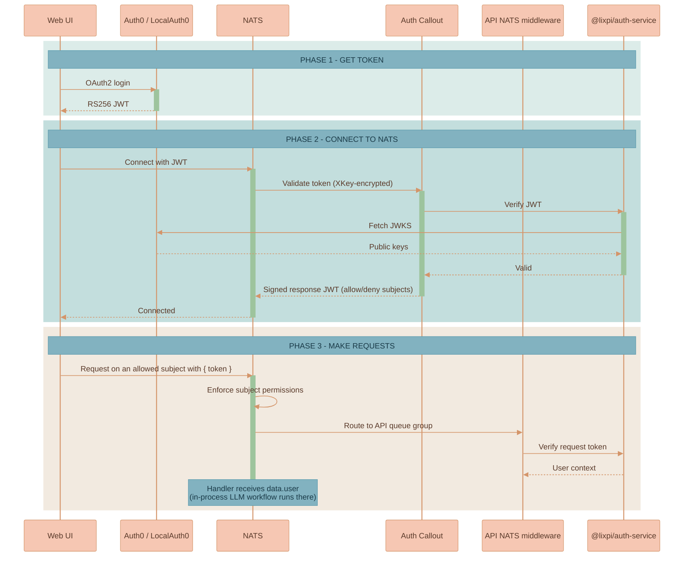
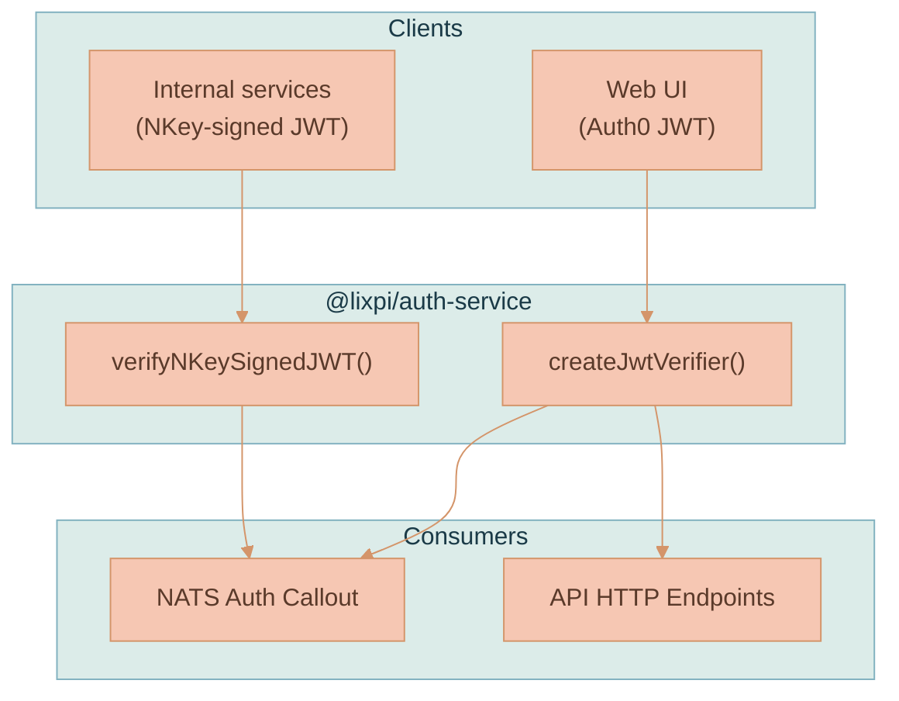
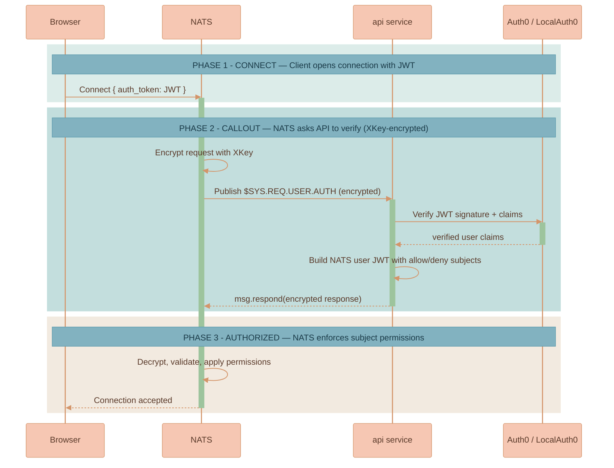

# Authentication

Authentication in Lixpi is split across two checks that work together. NATS handles connection-level permissions through an auth callout. The API also verifies the user JWT on each browser-originated NATS request before running the subject handler.

The main SPA and the user portal share browser identity behavior through `@lixpi/auth-client`. Each service creates its own auth client in its dependency lifecycle, maps the transport-neutral session into its own NATS connection, and injects both dependencies through `@lixpi/web-client-service-factory`. Production serves the clients from different origins: the main application uses the stack domain and the portal uses `user-portal.<domain>`. Each origin has its own Auth0 SDK token cache, but both use the same Auth0 application and Universal Login session. Opening the portal can therefore complete a silent authorization round trip without asking an already signed-in user for credentials again.

Auth0 must list the portal URL in Allowed Callback URLs, Allowed Logout URLs, and Allowed Web Origins. The NATS WebSocket `allowed_origins` list must include both the main and portal origins; Pulumi adds both for AWS stacks.

NATS keeps static credentials for trusted backend connections such as the system user and the API service account that runs the callout responder. Browser users, self-issued internal-service JWT clients, and NATS-native internal tools such as NEX are delegated to the auth callout.

This page explains the conceptual auth model. The AWS-specific certificate and TLS wiring lives in [NATS Cluster](./deployment/NATS-CLUSTER.md) and is linked where relevant.

## The Dual Authentication Model

Lixpi authenticates two fundamentally different kinds of clients, using two different credential types verified by the same shared library:

| Client | Credential | Algorithm | Verified against |
|--------|-----------|-----------|------------------|
| **Users** (browser) | Auth0 / LocalAuth0 JWT | RS256 (asymmetric) | The identity provider's JWKS endpoint |
| **Internal services** | NKey-signed JWT | Ed25519 | A locally configured NKey public key — no external dependency |
| **NATS-native internal tools** | Raw NATS NKey challenge-response | Ed25519 | A locally configured NKey public key in the API auth callout |

Both paths converge on `@lixpi/auth-service`, the shared verifier described below, and both result in a NATS connection scoped to exactly the subjects that principal is allowed to use.

NEX is the current NATS-native internal tool. Its seed, `NATS_NEX_NODE_NKEY_SEED`, belongs only in the NEX runtime. Its public key, `NATS_NEX_NODE_NKEY_PUBLIC`, is used in three places: NEX passes it to the NATS client as the public half of the native NKey credential, the NATS server config lists it so the server advertises a nonce for native NKey challenge signing, and the API auth callout uses it to verify the raw NKey signature. The NATS config entry is protocol support, not the final authorization decision; centralized auth callout still returns the user JWT that lands NEX in the `NEX` account.

## Authentication Flow

The end-to-end flow for a browser user is: obtain a token from the identity provider, connect to NATS presenting that token, let the auth callout verify the connection and subject permissions, then include the current JWT in each request payload so the API handler can verify the user again before touching data.

## `@lixpi/auth-service`: The Shared Verifier

All token verification is handled by `@lixpi/auth-service`, a shared package consumed by both entry points into the system:

- **NATS Auth Callout** — validates tokens during NATS connection for browser users and registered service JWTs.
- **API NATS middleware** — validates `data.token` on browser-originated NATS request payloads before subject handlers run.
- **API HTTP endpoints** — validates Bearer tokens or route tokens on REST calls.

It exposes two verifiers, one per credential type:

| Function | Credential | Behavior |
|----------|-----------|----------|
| `createJwtVerifier()` | Auth0 / LocalAuth0 RS256 JWT | Builds a verifier that validates signature and claims against the provider's JWKS |
| `verifyNKeySignedJWT()` | NKey-signed JWT | Verifies an Ed25519 signature locally — no network call, no Auth0 dependency |

## Connection Auth: The NATS Auth Callout

For browser users, NATS does not store user credentials. When a user connects, NATS asks the API: "is this JWT valid, and what subjects may this connection publish and subscribe to?" The API answers with a signed NATS user JWT containing allow/deny subject lists, and NATS enforces that answer for the lifetime of the connection.

Trusted backend clients are different: the NATS config includes static users for system/API connections. Those credentials are infrastructure secrets, not end-user credentials.

| Step | What happens |
|------|--------------|
| Connect | The client opens a connection presenting its JWT as the auth token |
| Encrypt | NATS encrypts the callout request with an **XKey** so the token is never exposed in transit on the bus |
| Verify | The API decrypts the request and verifies the JWT via `@lixpi/auth-service` |
| Build | The API constructs a NATS user JWT with explicit allow/deny subject permissions for that principal |
| Respond | The API returns the signed, XKey-encrypted response on the callout reply subject |
| Enforce | NATS validates the response, applies the permissions, and accepts (or rejects) the connection |


**The API must connect to NATS with `tls://`, not `nats://`.** The auth-callout reply path uses an internal NATS subject that only trusted (TLS) clients are permitted to publish to. Without TLS, subscriptions still appear to work, but callout *responses* silently fail and clients time out on connect. This is the single most subtle failure mode in the auth path.



The XKey encryption keys, the TLS certificates, and the AWS wiring that makes the callout reply path work in production are covered in [NATS Cluster](./deployment/NATS-CLUSTER.md) and the [NATS cluster README](../../infrastructure/pulumi/src/resources/NATS-cluster/README.md). This page stays at the conceptual level.


## Request Auth: API NATS Middleware

Connection permissions answer "may this client publish to this subject at all?" Subject handlers still need the concrete user identity for each request. Browser requests therefore include the current Auth0/LocalAuth0 JWT in the message payload as `token`.

The API installs `natsAuthMiddleware` when it registers its NATS subscriptions. The middleware verifies `data.token`, injects the verified user as `data.user`, and removes the raw token before the handler runs. Workspace handlers then authorize with that user context, for example by calling `Workspace.getWorkspace({ userId, workspaceId })` before returning data or mutating canvas state.

This means a workspace request has two checks:

| Layer | What it checks |
|-------|----------------|
| NATS connection permissions | The connection is allowed to publish/request on that subject shape. |
| API handler middleware | The specific request carries a valid user JWT, and the handler can authorize that user against the requested workspace/document/thread. |

## Two Authentication Modes

The same callout, the same shared verifier, and the same allow/deny enforcement serve two distinct credential types.

### Mode 1 — User Authentication (Auth0 / LocalAuth0)

For browser users authenticating through an identity provider:

- **OAuth2 flow** issuing RS256 JWTs.
- **JWKS endpoint validation** via `@lixpi/auth-service` (`createJwtVerifier()`) — the provider's public keys verify the token signature.
- **Permissions derived from subscription configurations** — the auth callout builds allow/deny subject lists from the registered subscription configs, while each handler still authorizes the specific workspace/document/thread request.

### Mode 2 — Service Authentication (NKey-signed JWTs)

For internal services that need to publish/subscribe on NATS without depending on Auth0:

- **Ed25519 cryptographic signatures**, verified **locally** via `verifyNKeySignedJWT()` — no JWKS fetch, no Auth0 round-trip.
- **No external dependency** — a service can authenticate even if Auth0 is unreachable, which is essential for backend-to-backend traffic.
- Each service is registered with scoped permissions for exactly the subjects it needs.


The `serviceAuthConfigs` array in `services/api/src/server.ts` is currently **empty** (`serviceAuthConfigs: []`) — no internal service is registered today, because the LLM workflow runs in-process within the API rather than as a separate NATS client. Registering a new entry per service is what would light up Mode 2, for example when splitting out an `llm-workers` service (see [System Architecture](./SYSTEM-ARCHITECTURE.md)). For the full recipe — keypair generation, JWT signing, registration, and permission scoping — see [Internal Service NATS Auth Pattern](../knowledge/INTERNAL-SERVICE-NATS-AUTH-PATTERN.md).


## LocalAuth0: Zero-Config Offline Development

**LocalAuth0** is a mock identity provider that makes the entire stack runnable offline, with no Auth0 account and no internet connection. It stands in for Auth0 in Mode 1 during local development.

- **Zero configuration** — initializes automatically on first `docker compose up` when `VITE_MOCK_AUTH=true`.
- **Production-like behavior** — generates RS256 keypairs and issues JWTs that match production Auth0's OAuth flows, so the same verification path exercises the same code.
- **Persistent state** — keypairs, the user record, custom claims, and permissions persist in the `localauth0-data` Docker volume across container restarts.
- **Default test user** — `test@local.dev` (`local|test-user-001`), preconfigured with permissions for the API audience.

Because LocalAuth0 issues real RS256 JWTs against a JWKS endpoint, the API and the NATS auth callout verify them through exactly the same `createJwtVerifier()` path they use for production Auth0. LocalAuth0 also refuses to run outside `local` environments as a safety guard. See [`services/localauth0/README.md`](../../services/localauth0/README.md) for endpoints, configuration, and troubleshooting.

## Where to Go Next

- [System Architecture](./SYSTEM-ARCHITECTURE.md) — how auth fits into the NATS-native system and the future `llm-workers` split.
- [NATS Cluster](./deployment/NATS-CLUSTER.md) — the AWS TLS/certificate wiring behind the callout reply path.
- [Internal Service NATS Auth Pattern](../knowledge/INTERNAL-SERVICE-NATS-AUTH-PATTERN.md) — the full recipe for Mode 2 service authentication.
