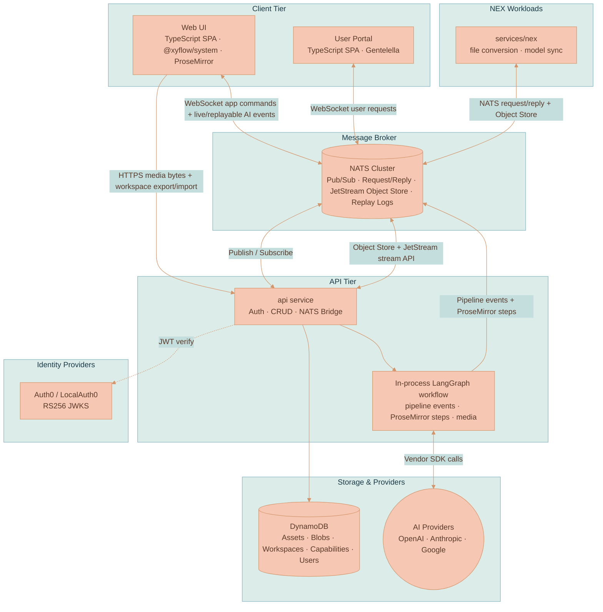
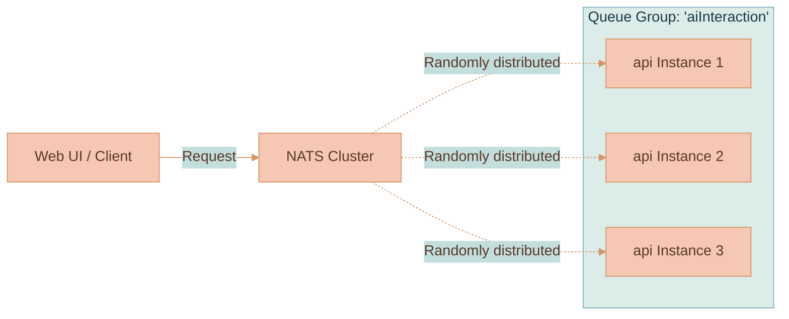

# System Architecture

Lixpi is a message-driven system built around [NATS](https://nats.io/). The browser uses NATS over WebSocket for normal app commands, Workspace and Asset CRUD, canvas-state saves, live AI pipeline events, and Asset-role ProseMirror step streams. The API service handles those subjects, persists bounded records in DynamoDB, and hosts the LangGraph workflow in-process. JetStream backs one content-addressed Blob Object Store bucket per organization plus short-lived durable replay logs for AI pipeline events and Asset document steps.

There are still HTTP routes where HTTP is the right tool: Asset upload/import and authenticated rendition download, Range-capable audio/video playback, authenticated Capability resource reads, health checks, and Workspace export/import archives. Those routes move browser-friendly bytes or ZIP files; they are not the primary app command path.

This page maps how the running system fits together: which services exist, how they talk, the design decisions that shaped them, and how the system scales.


This page covers the **runtime architecture**. For the AWS deployment topology (Pulumi, ECS/Fargate, CloudFront, the NATS cluster wiring), see [Infrastructure Overview](./deployment/INFRASTRUCTURE-OVERVIEW.md) and [Scaling & Operations](./deployment/SCALING-AND-OPERATIONS.md).


## Services

Lixpi runs as a small set of containerized services plus a managed datastore. Shared TypeScript packages live in `packages/lixpi/`; Infrastructure-as-Code lives in `infrastructure/pulumi/`.

| Service | Language | Path | Role |
|---------|----------|------|------|
| **web-ui** | TypeScript | `services/web-ui/` | Browser SPA — canvas rendering, ProseMirror editors, AI chat UI, and client-side context extraction. Vanilla TypeScript DOM components with Nano Stores for state |
| **web-ui-user-portal** | TypeScript | `services/web-ui-user-portal/` | User account SPA at `user-portal.<domain>` with Gentelella components backed by shared browser auth, routing, and user state |
| **api** | Node.js / TypeScript | `services/api/` | API service — JWT auth, CRUD, DynamoDB persistence, NATS bridge, **and the in-process LangGraph LLM workflow** at `services/api/src/llm/` (pipeline events, ProseMirror transcript steps, image generation, video generation, usage tracking) |
| **nats** | Go (3-node cluster) | `services/nats/` | Message bus — pub/sub, request/reply, organization Blob Object Store, and JetStream replay logs for pipeline/Asset-document events |
| **localauth0** | Rust (vendored) | `services/localauth0/` | Mock Auth0 for zero-config offline development — RS256 JWT signing, JWKS, same OAuth flows as production |
| **nex** | Node.js / TypeScript | `services/nex/` | NATS NEX execution-engine node — runs background workloads on the bus: the hourly AI-models catalog sync and heavy file conversion/frame extraction. See [NEX Execution Engine](./deployment/NEX-EXECUTION-ENGINE.md) |
| **DynamoDB** | AWS (local via Docker) | — | Asset/Blob metadata and references, Workspaces, Capabilities, Capability Runs, users, and AI model metadata |

The development-only [AI Model Registry](../../services/ai-model-registry/documentation/AI-MODEL-REGISTRY.md) runs separately from the production topology. It records provider models, parameters, compatibility, implementation state, and configuration-control decisions that must match NEX model synchronization, API provider code, and the web configuration matrix.


**Historical note.** LLM orchestration used to live in a separate Python `services/llm-api/` Fargate task using the Python LangGraph package. It was absorbed into `services/api` once the TypeScript LangGraph package covered Lixpi's workflow needs. The in-process LangGraph workflow now runs alongside the gateway logic in the `api` container. For the internal-service NATS auth pattern that the former Python service used — and that a future split would reuse — see [Internal Service NATS Auth Pattern](../knowledge/INTERNAL-SERVICE-NATS-AUTH-PATTERN.md).


### High-Level Architecture

Everything fans out from NATS. The browser connects to NATS over a WebSocket; the API connects to NATS over TLS; the LLM workflow runs inside the API process and publishes streaming events straight onto NATS subjects the browser is already subscribed to.



| Tier | Component | Responsibility |
|------|-----------|----------------|
| Client | Web UI | Renders the canvas, hosts ProseMirror editors, extracts context from the node graph, and connects to NATS over WebSocket |
| Client | User Portal | Displays account-management pages and connects to NATS over WebSocket with the same identity-provider session as the main UI |
| Broker | NATS Cluster | Carries app commands, auth callouts, CRUD requests, AI pipeline events, replay logs, Asset-role ProseMirror steps, and rendition requests; stores immutable Blob objects in organization Object Store buckets |
| API | api service | Validates tokens, performs CRUD against DynamoDB, hosts byte-oriented HTTP routes, and bridges browser requests to the in-process workflow |
| API | LangGraph workflow | Resolves sealed Capabilities, streams the text model, routes image/video Tool calls, and publishes pipeline events plus ProseMirror transcript steps to NATS |
| Workers | NEX workloads | Run long-lived background services on NATS, including file conversion/probing and AI-model catalog synchronization |
| Identity | Auth0 / LocalAuth0 | Issues RS256 user JWTs and exposes a JWKS endpoint for verification |
| Storage | DynamoDB | Persists Asset/Blob registries and references, Workspaces, Capabilities, Capability Runs, users, and AI model metadata |
| Storage | AI Providers | External text, image, and video models invoked through vendor SDKs |

## NATS as the Backbone

Most application behavior in Lixpi flows through NATS. This decision shapes the system:

- **End-to-end messaging** — Browser ↔ NATS ↔ backend services. The same bus carries browser requests and inter-service traffic.
- **Real-time streaming** — AI pipeline events stream directly to clients on per-thread subjects, with no intermediate HTTP streaming layer.
- **Durable replay windows** — JetStream stores short-lived pipeline event logs and ProseMirror document step logs so a refreshed client can replay missed generation state instead of falling back to stale snapshots.
- **Centralized auth** — The NATS `auth_callout` delegates "can this connection happen, and what may it do?" to the API service. See [Authentication](./AUTHENTICATION.md).
- **Queue groups** — Multiple instances of a service subscribe under a shared queue-group name, and NATS load-balances messages across them automatically. No external load balancer required.

HTTP remains in the system for payloads that are better served as HTTP responses:

| HTTP route family | Why it is HTTP |
|-------------------|----------------|
| `/api/assets/*` | Browser Asset upload/import, authenticated rendition download, audio/video Range requests, and media playback need ordinary HTTP semantics. Blob bytes are stored in organization-scoped NATS Object Store buckets; rendition work is handed off over NATS. |
| `/api/workspaces/:workspaceId/export` and `/api/workspaces/:workspaceId/import` | Workspace portability uses ZIP archives and multipart uploads. Normal workspace reads, writes, canvas-state updates, and deletion are still NATS subjects. |
| `/api/capabilities/*` | Authenticated Capability resource reads use HTTP byte responses; catalog commands and invalidations flow over NATS subjects. |
| `/health-check` | ECS needs a simple health endpoint. |

For the AI event path from provider output to rendered DOM, and the catalog of stream event types, see [Streaming & Events](./STREAMING-AND-EVENTS.md).

### Subject Naming Convention

Subjects follow a consistent hierarchical pattern so that domain, entity, and action are always legible from the subject string alone:

```
domain.entity.action[.qualifier]
```

| Example subject | Pattern | Meaning |
|-----------------|---------|---------|
| `user.get` | `domain.action` | Request: get user data |
| `asset.create` | `domain.action` | Request: create an Asset with a content or conversation role |
| `ai.interaction.chat.sendMessage` | `domain.entity.action.action` | Publish: browser → API |
| `ai.interaction.chat.receiveMessage.{scopeId}.{pipelineId}` | `…action.qualifier.qualifier` | Internal canonical live pipeline output; not browser-subscribable |
| `ai.interaction.chat.receiveMessage.{userIdToken}.{scopeId}.{pipelineId}` | `…action.qualifier.qualifier.qualifier` | Authorized API relay → one browser identity |
| `ai.interaction.chat.pipelineEvents.{workspaceId}.{pipelineId}` | `…action.qualifier.qualifier` | JetStream subject: durable replay of chat pipeline side events |
| `asset.document.steps.{organizationId}.{assetId}.{role}` | `domain.entity.action.qualifier.qualifier.qualifier` | Internal JetStream subject: durable Asset-role ProseMirror control/step events |
| `asset.document.events.{userIdToken}.{organizationId}.{assetId}.{role}` | `domain.entity.action.qualifier.qualifier.qualifier.qualifier` | Authorized live Asset-role relay for one browser identity |

The trailing qualifiers scope live subscriptions and JetStream replay subjects to one user, workspace/organization scope, pipeline, or Asset document role. Canonical live and JetStream subjects remain API-internal; tokenized relays reach only the browser identity authorized by the corresponding resume/start request.


Subjects are **not** ad-hoc strings scattered across the codebase. They are defined in `packages/lixpi/constants/nats-subjects.json` and consumed by both the browser and the API through `@lixpi/constants`. Adding or renaming a subject means editing that file, which keeps every producer and consumer in sync.


## Key Design Decisions

These decisions define the shape of the system and keep subsystem changes from spreading across service boundaries.

### NATS-First

App commands, auth callouts, Workspace and Asset mutations, canvas-state saves, Blob storage, AI pipeline events, and Asset-role ProseMirror transport all center on NATS. The browser connects to NATS via WebSocket. Because the LLM workflow publishes live pipeline events directly onto the conversation Asset subjects the browser is already subscribed to, there is no extra HTTP hop between provider output and browser updates. JetStream sits beside that live path for replay and storage, not as a polling layer.

The exception is byte transport: media upload/download, video range reads, authenticated previews, and workspace import/export use HTTP because browsers and archives already speak HTTP well.

### Framework-Agnostic Canvas

The canvas engine (`WorkspaceCanvas.ts`) is pure vanilla TypeScript with zero framework imports. It receives DOM elements and callbacks; the surrounding UI is also vanilla TypeScript DOM, with state held in Nano Stores. This insulates the canvas logic from framework changes and is why the rendering engine can stand on its own. See [Rendering Engine](../../packages/lixpi/canvas-engine/docs/RENDERING-ENGINE.md).

### Self-Contained Capability Modules

Each concrete Capability lives under `packages/lixpi/capability-system/src/capabilities/<module-id>/`. Its directory contains the capability-specific contracts, orchestration, prompts, policies, Tool and Skill packages, schemas, resources, and tests. Generic Capability infrastructure can execute and install a module, but it does not import concrete module behavior.

Application services provide infrastructure through typed ports defined by the module. Those adapters can authorize and load Assets, access storage, call selected providers, publish events, or send NATS requests. They do not own capability-specific prompts, scheduling, retry rules, assessment, composition, tracing, or cleanup. A module that needs deep media integration publishes its strategy through `CapabilityModuleDefinition.mediaStrategies`, and `CapabilityModuleCatalog` installs it without the API importing the strategy. See [Tools and Skills](../library/TOOLS-AND-SKILLS.md).

### Provider-Agnostic AI

Every AI request sends the full conversation history; no provider-specific session IDs are stored. A user can start a conversation with Claude, switch to GPT, switch to Gemini, and switch back. Adding a new provider means implementing the `BaseProvider` class in `services/api/src/llm/providers/`. The shared LangGraph workflow resolves sealed Tools and Skills plus branch candidates, executes explicitly required Tools, streams the text model with `search_capabilities` and `use_capability`, then conditionally routes `generate_image` and `generate_video` calls through transient media providers before calculating usage and cleaning up. See [AI Generation Pipeline](./AI-GENERATION-PIPELINE.md).

### Explicit Context Extraction

When a user sends a message, the canvas integration builds a workspace snapshot from the nodes explicitly attached to the composer. The API also extracts typed prompt references from the authoritative user message. It filters media candidates against the explicit allowlist, authorizes each Asset, resolves selected renditions, and assembles provider inputs while preserving canvas node IDs separately from Asset IDs. See [Explicit Workspace Context](../ai-chat/CONTEXT-RELEVANCE.md).

## Scalability & Load Balancing

The `api` service is **stateless** (it now hosts the LLM workflow in-process) and scales horizontally with zero configuration changes. Scaling out is a matter of starting more instances:

1. **Service registration** — A new instance connects to NATS and subscribes to its relevant subjects using a queue-group name (for example, `aiInteraction`).
2. **Automatic discovery** — NATS immediately recognizes the new subscriber as part of the group.
3. **Load distribution** — NATS delivers each message to **one** group member, chosen at random.
4. **Fault tolerance** — If an instance crashes, NATS detects the disconnection and reroutes traffic to the remaining healthy instances.

No routing configuration updates are needed — instances are added or removed dynamically.

### NATS Queue Groups

Instead of a traditional external load balancer (Nginx, AWS ALB), Lixpi leverages NATS **Queue Groups**. When multiple instances of a service subscribe to the same subject under the same queue-group name, NATS distributes messages among them. The load balancer *is* the message bus.



### Future Split: `llm-workers`

If LLM streaming workload grows enough to warrant deployment isolation from the gateway — so that an API deploy does not interrupt long-running streams — the LLM module is shaped so it can be split into a separate `llm-workers` service. That split still needs implementation work: `getSubscriptions()` is currently empty, the worker command would need to register real NATS subscriptions, and the auth callout would need an internal-service entry for the worker. See [`services/api/src/llm/README.md`](../../services/api/src/llm/README.md) for the future-split path, and [Scaling & Operations](./deployment/SCALING-AND-OPERATIONS.md) for how it maps onto AWS.

## Shared Infrastructure Packages

Shared packages in `packages/lixpi/` keep service contracts in sync so that the browser and the API can never drift on subjects, types, or auth logic.

| Package | Purpose |
|---------|---------|
| `@lixpi/constants` | Shared NATS subjects, shared types, AI model metadata with pricing |
| `@lixpi/capability-system` | Self-contained concrete Capability modules plus cross-runtime validation, backend resolution, action registration, workflow execution, dispatch, module composition, and provider-neutral model Tool definitions |
| `@lixpi/canvas-engine` | Shared canvas geometry, collision, lineage layout, connector, animation, and rendering modules split by runtime boundary |
| `@lixpi/nats-service` | TypeScript NATS client, JetStream stream/direct-message helpers, JetStream Object Store helpers, NKey auth |
| `@lixpi/auth-service` | JWT verification (Auth0 RS256 + NKey Ed25519) used by both the API and the NATS Auth Callout |
| `@lixpi/nats-auth-callout-service` | NATS connection auth with per-service permission scoping |
| `@lixpi/prosemirror` | Shared ProseMirror schema, headless engine, stream assembly helpers, lineage projection helpers, and document-step transport types used by API and web-ui |
| `@xyflow/system` | Framework-agnostic pan/zoom and coordinate math used through its low-level API rather than a framework wrapper |

## Where to Go Next

- [Authentication](./AUTHENTICATION.md) — the dual auth model, the NATS auth callout, and the two auth modes.
- [AI Generation Pipeline](./AI-GENERATION-PIPELINE.md) — the LangGraph workflow, providers, and tool-call routing.
- [Streaming & Events](./STREAMING-AND-EVENTS.md) — live AI events, durable replay logs, ProseMirror step streams, and the event catalog.
- [Rendering Engine](../../packages/lixpi/canvas-engine/docs/RENDERING-ENGINE.md) — the framework-agnostic canvas.
- [Explicit Workspace Context](../ai-chat/CONTEXT-RELEVANCE.md): how prompt references and composer chips become multimodal context.
- [Infrastructure Overview](./deployment/INFRASTRUCTURE-OVERVIEW.md) and [Scaling & Operations](./deployment/SCALING-AND-OPERATIONS.md) — the AWS topology, Pulumi, and production scaling.
