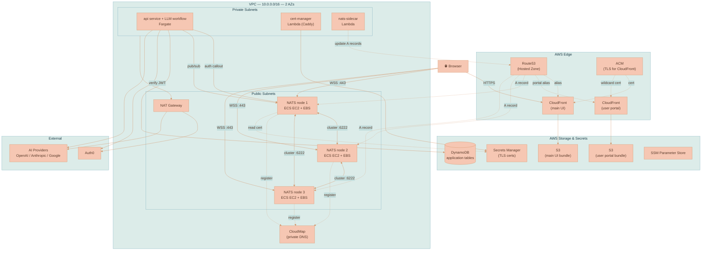
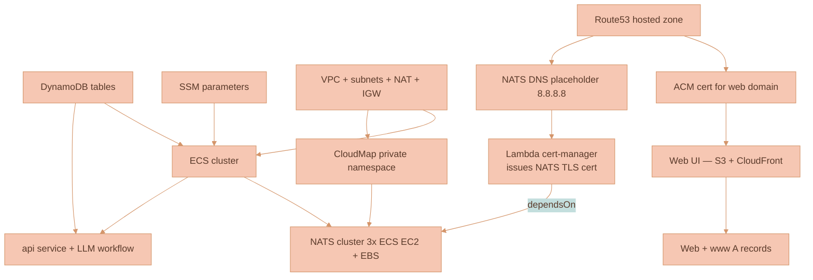
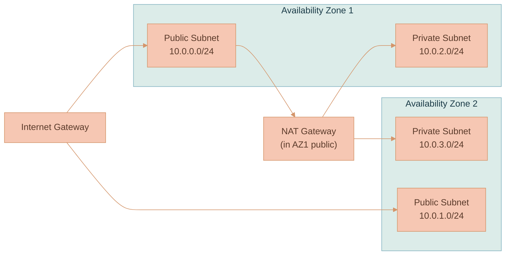
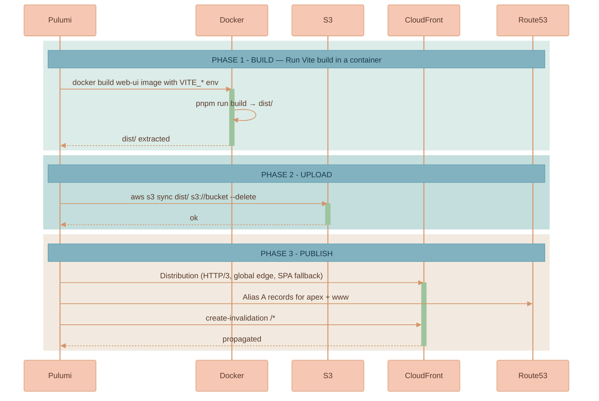
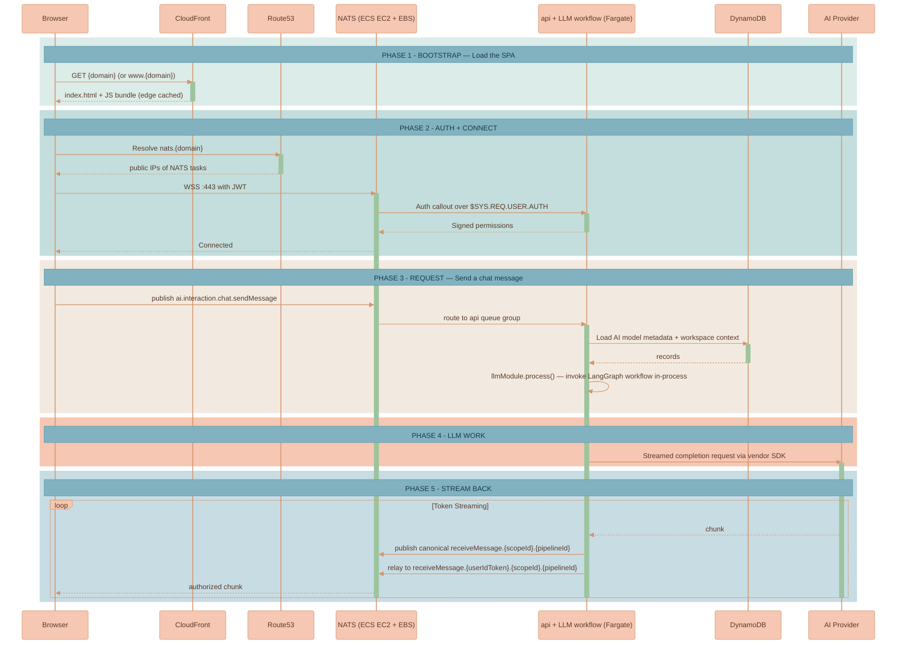

# Infrastructure Overview

This page explains how Lixpi is deployed to AWS: how Pulumi provisions the infrastructure, how the topology fits together, how the network is laid out, and how each piece — the `api` service, the Web UI, and DynamoDB — lives inside AWS.

It is the entry point for the deployment domain. The NATS cluster has enough moving parts to deserve its own page; see [NATS Cluster](./NATS-CLUSTER.md). Scaling, environments, and day-to-day operations live in [Scaling & Operations](./SCALING-AND-OPERATIONS.md). For the runtime architecture and service responsibilities, see [System Architecture](../SYSTEM-ARCHITECTURE.md).

## Core Concepts

A handful of building blocks recur throughout the deployment. Understanding them first makes the rest of this domain read quickly.

| Concept | What it is |
|---------|------------|
| **Pulumi** | Infrastructure-as-Code tool. Lixpi uses the Pulumi **TypeScript** SDK to describe every AWS resource (VPC, ECS, DynamoDB, CloudFront, Route53, Lambda, IAM, ACM, CloudMap). The Pulumi program itself runs inside a Docker container so developers don't need Pulumi installed locally. |
| **Stack** | A named Pulumi environment (for example `shelby-dev` or `production`). Each stack has its own state and its own AWS resources. One stack = one full copy of Lixpi. |
| **ECS on Fargate** | AWS's serverless container runtime. Every Lixpi backend service runs as a Fargate task; there are no EC2 instances to manage. |
| **CloudMap** | AWS service discovery. NATS servers use a **private** CloudMap namespace to find each other inside the VPC, and a Route53 **public** DNS record (managed by a small Lambda sidecar) so browsers can reach them over the internet. |
| **CloudFront + S3** | Each browser SPA is built into its own S3 bucket and served through its own global CloudFront distribution. The main UI uses the stack domain; the user portal uses `user-portal.<domain>`. |


**NATS auth callout.** Instead of storing NATS user credentials, the `api` service acts as a live authorization service: NATS asks the API "can this JWT connect?", the API answers, and NATS enforces the answer. This page only names the mechanism — the conceptual model lives in [Authentication](../AUTHENTICATION.md), and the AWS-specific wiring lives in [NATS Cluster](./NATS-CLUSTER.md).


## High-Level AWS Topology



| Component | AWS Resource | Purpose |
|-----------|--------------|---------|
| `web-ui` | S3 + CloudFront | Static SPA served from a global CDN with HTTP/3 |
| `web-ui-user-portal` | S3 + CloudFront | Independent account-management SPA served from `user-portal.<domain>` |
| `api` | ECS/Fargate (private subnets) | CRUD, auth callout, DynamoDB access, AND in-process LangGraph LLM workflow (pipeline events, ProseMirror transcript steps, image generation, vendor SDK egress) |
| `nex` | ECS/Fargate (private subnets, 1 task) | NATS NEX node — runs background workloads (the hourly AI-models sync), writes the `AI_MODELS_LIST` table. See [NEX Execution Engine](./NEX-EXECUTION-ENGINE.md) |
| `nats` | ECS EC2 daemon service (3 public-subnet instances, one encrypted EBS volume each) | Message bus, three-replica JetStream, and Blob Object Store; clients connect directly |
| `cert-manager` | Lambda (Caddy + ACME) | Issues real TLS certs for the NATS domain |
| `nats-sidecar` | Lambda | Watches ECS task IPs and updates Route53 A records |
| `DynamoDB` | On-demand application tables | Application data, with streams on selected tables |
| `Route53` | Hosted zone | DNS for web UI, API, NATS |
| `ACM` | Certificate | TLS for CloudFront (web UI) |
| `Secrets Manager` | Secrets | Stores NATS TLS certs issued by cert-manager |
| `SSM` | Parameter Store | Cross-stack parameters and config |
| `CloudMap` | Private namespace | Internal NATS cluster discovery |

## Pulumi: How Infrastructure is Described

The Pulumi program lives in [`infrastructure/pulumi/src/`](../../../infrastructure/pulumi/src/). The entry point is [`pulumiProgram.ts`](../../../infrastructure/pulumi/src/pulumiProgram.ts), which calls resource factories in order.

### Project Layout

```
infrastructure/pulumi/src/
  cli.ts                  # yargs CLI: init | up | preview | destroy | ...
  stackManager.ts         # Wraps @pulumi/pulumi automation API
  workspace.ts            # Pulumi workspace + AWS config
  pulumiProgram.ts        # The actual infra program (top-level orchestrator)
  local-dynamodb-init.ts  # DynamoDB Local bootstrap for dev
  resources/
    network.ts            # VPC, subnets, IGW, NAT, route tables
    ECS-cluster.ts        # Shared Fargate cluster
    NATS-cluster/         # 3-node NATS cluster + service discovery sidecar
    main-api-service.ts   # api service (ECS task) — also hosts the LLM workflow in-process
    web-ui.ts             # Shared static-SPA resource and main Web UI wrapper
    web-ui-user-portal.ts # User portal static-SPA wrapper
    db/DynamoDB-tables.ts # DynamoDB table definitions
    dns-records.ts        # Route53 records + hosted zone
    certificate.ts        # ACM certificate for the web domain
    certificate-manager/  # Lambda-based Caddy TLS issuer for NATS
    SSM-parameters.ts     # Cross-stack SSM parameters
```

### Dockerized Pulumi Runner

Developers never run `pulumi` directly. [`infrastructure/pulumi/Dockerfile`](../../../infrastructure/pulumi/Dockerfile) packages the CLI, AWS tools, and Node runtime. The image mounts the repo, reads the `.env.<name>-<environment>` file, and runs a single command:

```bash
# Triggered by the top-level shell scripts
docker run ... lixpi/pulumi up
```

The CLI supports `init`, `up`, `preview`, `destroy`, `force-destroy`, `clean-ecr`, `refresh`, `outputs`, `list-stacks`, `create-stack`, `remove-stack`, `cancel` — see [`cli.ts`](../../../infrastructure/pulumi/src/cli.ts).

### Local vs AWS Mode

The program inspects `ENVIRONMENT`. When it's `local`, only the DynamoDB tables are created (against DynamoDB Local through a custom provider), and the program returns early. Everything else — VPC, ECS, NATS, certs, CloudFront — is created only when `ENVIRONMENT !== 'local'`.

```typescript
const DEPLOY_TO_AWS = process.env.ENVIRONMENT !== 'local'
const USE_LOCAL_DYNAMODB = !DEPLOY_TO_AWS
// ... create DynamoDB tables (always)
if (!DEPLOY_TO_AWS) return { dynamoDBtables }
// ... everything else runs only for real AWS stacks
```

### Staged legacy-table removal

The Asset/Blob cutover removed the document, chat-thread, and media-library tables from the active table contract. Production tables had DynamoDB deletion protection, so their infrastructure removal requires two Pulumi deployments against the same stack:

1. Before the removal window, set `LEGACY_STORAGE_REMOVAL_STAGE=retain` explicitly. Pulumi retains the inert legacy resource URNs and keeps production deletion protection enabled.
2. Set `LEGACY_STORAGE_REMOVAL_STAGE=disable-protection` and deploy. Pulumi retains the same resource URNs and updates only `deletionProtectionEnabled` to `false`.
3. Set `LEGACY_STORAGE_REMOVAL_STAGE=remove` (or unset it, because `remove` is the completed phase-11 default) and deploy again. The legacy definitions are absent, so Pulumi deletes the now-unprotected tables.

Do not skip the disable-protection deployment on a stack that still owns protected resources. Do not set `retain` again after removal because that would redeclare the retired tables. Local DynamoDB definitions contain only the current tables and do not participate in this removal gate.

Legacy Object Store buckets were created dynamically and are not Pulumi
resources. After the revision-2 archive/rollback artifact is verified and the
cutover release is active, enumerate NATS Object Stores and delete only the
retired families `workspace-<workspaceId>-files` and
`media-library-<scope>-<scopeOwnerId>-files` through the NATS administrative
path. [`remove-legacy-object-stores.ts`](../../../services/api/src/debug-tools/remove-legacy-object-stores.ts)
enumerates those exact retired families in dry-run mode and requires
`--confirm-delete-legacy-object-stores` before calling the destructive Object
Store operation. It always excludes `blobs-<organizationId>-files`; those are
the active content-addressed buckets. Current Workspace deletion contains no
bucket-lifecycle call.

### Deployment Order

Pulumi figures out the dependency graph automatically, but the program is written in the order that matches the dependency chain. A few edges are explicit via `dependsOn`:



The explicit `dependsOn` relationship worth highlighting:

- **NATS depends on cert-manager** — NATS must not start until Caddy has written a valid TLS cert to Secrets Manager, otherwise the cluster boots with self-signed certs and browsers reject the WebSocket handshake.

## Network Layout

[`network.ts`](../../../infrastructure/pulumi/src/resources/network.ts) builds a classic two-AZ VPC:



| Subnet | CIDR | What runs there |
|--------|------|-----------------|
| Public AZ1 | `10.0.0.0/24` | NATS EC2 instances, NAT Gateway |
| Public AZ2 | `10.0.1.0/24` | NATS EC2 instances |
| Private AZ1 | `10.0.2.0/24` | api, Lambdas |
| Private AZ2 | `10.0.3.0/24` | api, Lambdas |

**Why NATS sits in public subnets.** Browsers connect directly to NATS over WebSocket Secure. Each NATS EC2 host has a routable public IP that the discovery sidecar can publish to Route53. The daemon task uses host networking and stores JetStream data on the host's mounted EBS volume.

**Why api sits in private subnets.** The main app-command path reaches the API through NATS subjects, so the Fargate service does not need public ingress for normal Workspace/Asset operations or AI streaming. Outbound traffic (Auth0, OpenAI, Anthropic, Google, Stability) goes through the single NAT Gateway.

The API process also defines HTTP routes for media bytes, Capability resources, workspace export/import, and health checks. Local development calls those routes directly through `VITE_API_URL`. The current AWS topology shown here does not create a public `api.*` route or a CloudFront API origin, so any production feature that depends on those HTTP routes needs an explicit front door before it can work from the hosted SPA.

## ECS Services: api

The `api` service follows the standard pattern: a Docker image pushed to ECR, a Fargate task definition, an IAM role scoped to the resources it needs, CloudWatch logs, and a security group with no public ingress in the current Pulumi topology. It is defined in [`main-api-service.ts`](../../../infrastructure/pulumi/src/resources/main-api-service.ts).

| Service | CPU | Memory | Subnets | Public IP | Inbound | Scale |
|---------|-----|--------|---------|-----------|---------|-------|
| `api` | 512 | 1024 MB | Private | no | none in current AWS topology | configurable |

The CPU/memory baseline is sized to accommodate the in-process LangGraph LLM workflow (live pipeline events, ProseMirror step assembly, image generation, and vendor SDK egress) that previously ran in the separate `llm-api` Fargate task.

### Why No Load Balancer for NATS Subjects?

For NATS request/reply subjects, there is nothing HTTP-shaped to route. The service pulls work off NATS subjects using **queue groups**. When you add another `api` task, it joins the same queue group, NATS starts distributing messages across the tasks, and no external load balancer needs to know about that subject.

That does not remove the need for an HTTP front door for byte routes. The Express routes under `/api/assets`, `/api/workspaces`, and `/api/capabilities` exist in the API service; exposing them from the hosted SPA is a separate deployment concern.

The revision-2 storage cutover removes the legacy document, chat-thread, and media-library tables after their deletion protection is disabled. Production therefore requires two explicitly staged removal deployments: `disable-protection`, then `remove`. Phase 11 defaults to the completed `remove` state so retired resources are not recreated; use explicit `retain` only before the removal window. Verify the revision-2 export/rollback artifact before the second deployment. Do not target-delete protected tables or bypass Pulumi state.

### Deployment Strategy

The service uses standard rolling deploy settings:

- `deploymentMinimumHealthyPercent: 50` — at least half the desired tasks stay up during a deploy.
- `deploymentMaximumPercent: 200` — ECS may double the task count briefly to swap in new images.
- `deploymentCircuitBreaker.enable: true, rollback: true` — if new tasks fail health checks, ECS rolls back automatically.
- `forceNewDeployment: true` — every `pulumi up` replaces running tasks so new code actually ships.

### IAM Bindings — Principle of Least Privilege

Each service gets a `taskRole` with only the permissions it actually needs:

- `api` — DynamoDB point, batch, query/scan, and `TransactWriteItems` access on its bound tables and indexes; SSM read; CloudWatch Logs write. AI provider keys (OpenAI, Anthropic, Google, Stability) are passed via env vars; egress to vendor APIs flows through the NAT Gateway.
- `nats` — CloudWatch Logs + Secrets Manager read (for the TLS cert). Nothing else.


**Historical note.** The previous architecture split AI orchestration into a separate `llm-api` Fargate task with its own narrower IAM role (no DynamoDB) so a compromise of the LLM container couldn't touch user data. After the migration to in-process LangGraph TS, the API container is the trust boundary for both. If that trade-off becomes a concern, the LLM module can be split into a separate `llm-workers` ECS service, but the worker subscriptions and internal-service auth registration still need to be implemented. See [`services/api/src/llm/README.md`](../../../services/api/src/llm/README.md).


## Web Client Deployment

[`web-ui.ts`](../../../infrastructure/pulumi/src/resources/web-ui.ts) provides the shared static-SPA resource. The main UI wrapper creates the apex and `www` aliases, while [`web-ui-user-portal.ts`](../../../infrastructure/pulumi/src/resources/web-ui-user-portal.ts) creates an independent bucket and distribution with only the `user-portal.<domain>` alias. Both are static assets, not running services:



Some things to note:

- **403 and 404 → index.html with 200** — this turns CloudFront into a proper SPA host; client-side routing handles deep links.
- **HTTP/3 + `PriceClass_All`** — edge locations worldwide, with the latest protocol for low-latency connections.
- **`VITE_NATS_SERVER` is baked at build time** — the SPA knows which NATS cluster to connect to from the HTML it was served.
- **Build state is isolated per SPA**: each Docker builder, extracted `dist` directory, S3 bucket, invalidation, and CloudFront distribution has a service-specific name.
- **Authentication remains one SSO system**: the portal receives its own redirect URI but uses the same Auth0 tenant, client ID, and audience. The Auth0 dashboard must allow the portal callback, logout, and web-origin URLs.

## DynamoDB

[`db/DynamoDB-tables.ts`](../../../infrastructure/pulumi/src/resources/db/DynamoDB-tables.ts) defines the application tables through a shared table-definition function (`getTableDefinitions()`). The same definitions are reused by [`local-dynamodb-init.ts`](../../../infrastructure/pulumi/src/local-dynamodb-init.ts) to bootstrap DynamoDB Local for development, so local and cloud schemas stay aligned. Existing local tables are force-recreated from the current definitions by default (interactive runs are prompted; `LOCAL_DYNAMODB_FORCE_RECREATE=true|false` overrides), and each recreation logs the table's item count so any local data loss is explicit — see [`local-dynamodb-table-reconciler.ts`](../../../infrastructure/pulumi/src/local-dynamodb-table-reconciler.ts).

Highlights:

| Table | Hash / Range | Indexes | Notes |
|-------|--------------|---------|-------|
| `USERS` | `userId` | — | |
| `WORKSPACES` / `WORKSPACES_META` | `workspaceId` | — | Split for hot canvas state vs cold meta |
| `WORKSPACES_ACCESS_LIST` | `userId / workspaceId` | LSI on createdAt, updatedAt | |
| `ASSETS` | `assetId` | — | Aggregate identity, documents, media, lineage, state, and counters |
| `ASSETS_META` | `scopeAndOwner / assetId` | LSI on updatedAt | Scope/principal list projections |
| `ASSETS_ACCESS_LIST` | `assetId / principalId` | — | Point authorization and grant cleanup |
| `ASSET_REFERENCES` | `assetId / referenceKey` | — | Workspace placements and catalog lifetime references |
| `BLOBS` | `blobKey` | — | Organization-qualified immutable-object registry |
| `BLOB_REFERENCES` | `blobKey / referenceKey` | — | Idempotent Asset/Capability ownership of Blob objects |
| `CAPABILITIES` | `capabilityId` | — | Capability authority row and current manifest pointer |
| `CAPABILITIES_META` | `scopeAndOwner / searchKey` | — | Scope and principal catalog projections |
| `CAPABILITIES_ACCESS_LIST` | `capabilityId / principalId` | — | Explicit Capability grants |
| `CAPABILITY_RUNS` | `runId / workspaceId` | — | Sealed run index, state, and event-stream coordinates |
| `AI_TOKENS_USAGE_TRANSACTIONS` | `userId / transactionProcessedAt` | LSI x4 (document, model, org, formatted date) | Usage ledger |
| `FINANCIAL_TRANSACTIONS` | `userId / transactionId` | LSI on status, createdAt, provider | Billing |
| `AI_MODELS_LIST` | `provider / model` | — | Provider/model registry |

The six Asset/Blob tables have no GSIs; `ASSETS_META.updatedAt` is their only secondary index. Capability tables use their primary keys without GSIs. All real-AWS stacks enable DynamoDB **streams** with `NEW_AND_OLD_IMAGES` (skipped only for local DynamoDB). **Deletion protection** is additionally enabled on production stacks only. Retired document/thread/media-library table definitions exist only inside the explicit staged-removal helper and are excluded from the normal resource set.

## How Services Communicate — End to End

This is the per-request picture for an AI chat message, showing every hop on AWS. It's a concrete version of the abstract diagram in [System Architecture](../SYSTEM-ARCHITECTURE.md), with the infrastructure pieces filled in.



Two things to note:

1. **AI events flow from API to NATS through authorized relays.** The API does the setup work (DynamoDB lookup, context enrichment, auth), then runs the LangGraph workflow in-process. Live pipeline events publish to an internal canonical subject and are relayed to a tokenized browser subject only after authorization; AI chat text is mirrored into internal ProseMirror document steps with authorized replay/live relays. Streaming latency is dominated by the AI provider, not by Lixpi's infrastructure.
2. **Scale-out is drop-in.** Add a second `api` task and NATS starts splitting `ai.interaction.chat.sendMessage` messages between the two workers automatically. No load balancer config to update.

## Related Pages

| Page | What it covers |
|------|----------------|
| [NATS Cluster](./NATS-CLUSTER.md) | The NATS cluster internals: ports, CloudMap discovery, the Lambda sidecar for public access, Caddy-in-Lambda TLS, and the auth-callout security boundary |
| [Scaling & Operations](./SCALING-AND-OPERATIONS.md) | Horizontal scaling, capacity ceilings, failure modes, environments and stacks, operational workflow, and observability |
| [System Architecture](../SYSTEM-ARCHITECTURE.md) | The runtime architecture, queue groups, subject conventions, and design decisions |
| [Authentication](../AUTHENTICATION.md) | The conceptual dual-auth model and the NATS auth callout |
